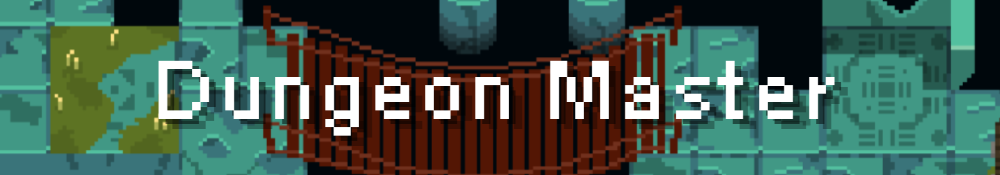

A hero was tending to his ill grandmother. To find a cure for her disease he searched the streets and a mysterious man informs him of a healing tome located deep in a dungeon. He is curious so he finds the dungeon and explores it, but he's tricked and he's trapped. He has to fight to be able to leave the dungeon or die there.

You have two choices of weapons, a bow and a sword. The game consist of three types of rooms:
1) Regular dungeons levels
2) Safe rooms
3) Boss rooms
The regular rooms are randomized and the game chooses from a set of 6 rooms for the next one (kinda like Hades). There are two Boss rooms which appear at the start and at the end of the game. Safe rooms appear every 3 levels.

There is a timer that doesn't show the exact time but a approximate of how much time is left before the cave collapses. If the timer runs out the game ends.

Made with 💖 by
<a href="https://github.com/lillylike123">Amira</a>, 
<a href="https://github.com/ZYR0PH4G3">Arnav</a>, 
<a href="https://github.com/khapilesh">Khapilesh</a>, 
<a href="https://github.com/rapidSpeed4652">Ahad</a> & <a href="https://github.com/ansh33430w">Ansh</a>

# Credits ✨
* DungeonFont by vrtxrry
* DungeonUI by 0x72
* Animated Goblins by Calciumtrice
* Animated Statue by Calciumtrice
